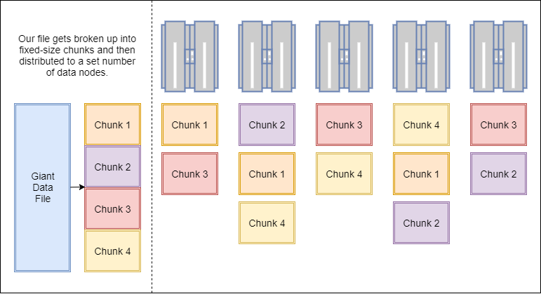
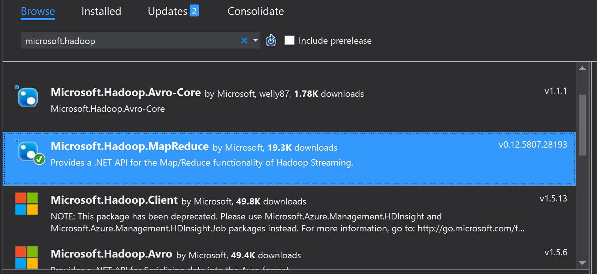

## Much Ado About Hadoop

<a href="https://www.catallaxyservices.com">Kevin Feasel</a> (<a href="https://twitter.com/feaselkl">@feaselkl</a>)
<a href="https://csmore.info/on/hadoop">https://CSmore.info/on/hadoop</a>

---

@title[Who Am I?]

@snap[west splitscreen]
<table>
	<tr>
		<td></td>
		<td><a href="https://csmore.info">Catallaxy Services</a></td>
	</tr>
	<tr>
		<td></td>
		<td><a href="https://curatedsql.com">Curated SQL</a></td>
	</tr>
	<tr>
		<td></td>
		<td><a href="https://wespeaklinux.com">We Speak Linux</a></td>
	</tr>
</table>
@snapend

@snap[east splitscreen]

	
	 
	<a href="https://www.twitter.com/feaselkl">@feaselkl</a>

@snapend

---

@title[Basic Overview]

## Agenda

1. **Basic Overview**
2. (2007-2011) The Birth of Hadoop
3. (2012-2014) Hadoop Hits the Mainstream
4. (2014-2016) Faster, Please
5. (2016-Now) Streaming and Cloud
6. Comparison to SQL Server
7. Microsoft and Hadoop

---?image=presentation/assets/background/paper-stack.jpg&size=cover&opacity=20

### The Origins of Hadoop

Hadoop started as a pair of Google whitepapers:  the Google File System and MapReduce.  Doug Cutting, while working at Yahoo, applied these concepts to search engine processing.

Since then, Hadoop has taken off as its own ecosystem, allowing companies to process petabytes of data efficiently over thousands of machines.

---?image=presentation/assets/background/lake.jpg&size=cover&opacity=20

### Great Use Cases

* Processing gigantic numbers of records, where a single-server solution is cost prohibitive or unavailable.
* "Cold storage" of relational data with PolyBase.
* Real-time ETL and streaming of data.
* Statistical analysis of gigantic data sets.
* A central data repository (data lake).

---?image=presentation/assets/background/engineering.jpg&size=cover&opacity=20

### Important Skills

* Java -- You can use other languages (e.g., Scala, Python, even C#) but Java is the most prevalent.
* SQL -- There are several SQL engines in the Hadoop ecosystem including Hive, Spark SQL, and Phoenix.
* Shell scripting -- Knowledge of Bash is vital for administering a Hadoop cluster and even writing jobs to operate against your cluster.
* Linux -- Some components can run on Windows, but <strong>everybody</strong> uses Linux.

---

### Gotta Catch 'Em All

Warning:  many of these products have names very similar to Pokemon.  Ex:  Metron vs Magneton.

---

@title[The Birth of Hadoop]

## Agenda

1. Basic Overview
2. **(2007-2011) The Birth of Hadoop**
3. (2012-2014) Hadoop Hits the Mainstream
4. (2014-2016) Faster, Please
5. (2016-Now) Streaming and Cloud
6. Comparison to SQL Server
7. Microsoft and Hadoop

---?image=presentation/assets/background/old-equipment.jpg&size=cover&opacity=20

### The Hardware Paradigm

* Lots of off-the-shelf servers with direct attached storage.  "Lots" was dozens, then hundreds, then thousands.
* Storage was primarily spinning disk.
* Servers were held on-prem.
* Servers were phyiscal machines.
* There was some expectation of server failure.

This hardware paradigm drove technical decisions.

---?image=presentation/assets/background/repetition.jpg&size=cover&opacity=20

### Node Types

There are two primary node types in Hadoop:  the NameNode and data nodes.

The <strong>NameNode</strong> is also known as the control node or the head node.  It is responsible for communication with the outside world, coordination with data nodes, and ensuring that jobs run.

Data nodes store data and run code, returning results back to the NameNode to make available to the user.

---

### HDFS

The <strong>Hadoop Distributed File System</strong> splits data into fixed-size chunks (e.g., 256MB), distributing and replicating to data nodes automatically.

---?image=presentation/assets/background/records.jpg&size=cover&opacity=20

### HDFS

HDFS is <strong>append-only</strong>, meaning you can add rows to an existing file, but cannot modify or delete rows in an existing file.  Deleting or modifying rows requires deleting and re-loading that file, and  even adding rows probably should be done in a different file.

A common pattern is to use folders to hold similar data and process all data in that folder as a unit.  In that case, we still want the invidiual files to be large enough to chunk out and distribute.

---?image=presentation/assets/background/ram.jpg&size=cover&opacity=20

### The Software Paradigm

* On Linux, C is still popular, but Java is the most cross-portable.
* RAM is much faster than disk but is limited.
* Network bandwidth is somewhat limited.
* Data structure is context-sensitive and the same file may have several structures.
* Developers know the data context.

This is how we got semi-structured data retrieval with MapReduce.

---

### Data Retrieval

Hadoop follows a "semi-structured" data model:  you define the data structure not when adding files to HDFS, but rather upon retrieval.  You can still do ETL and data integrity checks before moving data to HDFS, but it is not mandatory.

By contrast, a Kimball-style data warehouse is a structured data model:  ETL is required before loading data into the warehouse.  Once the data is in, queries can make good assumptions about data integrity and structure.

---

### Data Retrieval

Semi-structured data helps in two situations:

* Different lines have different sets of values.
* Different applications need the data aligned different ways.

---?image=presentation/assets/background/map.jpg&size=cover&opacity=20

### MapReduce

* **Map**:  filter and sort data
* **Reduce**:  aggregate data

Hadoop combines the Map and Reduce operations as part of its MapReduce engine.  Each Hadoop "query" performs mapping and reduction on specific nodes in sequence.

The nodes which perform mapping may not be the same nodes which perform reduction, allowing for large-scale performance improvement.

---

### MapReduce

<a href="http://www.infosun.fim.uni-passau.de/cl/MapReduceFoundation/">Image Source</a>

---?image=presentation/assets/background/surfer-crash.jpg&size=cover&opacity=20

### The Downside of MapReduce

The primary downside to MapReduce is that it takes a large amount of code to get actual work done (insert your own Java joke here). To counter this, various groups quickly came up with different add-ons and other languages.

---

### HBase

One of the first add-ons in the Hadoop ecosystem was HBase, a non-relational database meant for near-real-time data modification.

Powerset created HBase in 2008, and its first big use was Facebook Messenger.

---

### Pig

In 2008, Yahoo created Pig, a procedural language designed for ETL.  Pig generates MapReduce jobs in significantly fewer lines of code.

---

### Hive

Facebook developed Hive and first released it in 2010.  Hive was developed for Hadoop warehousing, allowing users to write SQL queries.  For this reason, Hive has been the most popular tool in the Hadoop ecosystem.

---

### Hadoop Goes Corporate

In 2008, Cutting left Yahoo and formed Cloudera.  MapR followed in 2009 and Hortonworks in 2011.

---

@title[Hadoop Hits the Mainstream]

## Agenda

1. Basic Overview
2. (2007-2011) The Birth of Hadoop
3. **(2012-2014) Hadoop Hits the Mainstream**
4. (2014-2016) Faster, Please
5. (2016-Now) Streaming and Cloud
6. Comparison to SQL Server
7. Microsoft and Hadoop

---?image=presentation/assets/background/white-wall.jpg&size=cover&opacity=60

### In the Mainstream

By 2012, Hadoop had become the next "it" technology.  We were getting into the peak of inflated expectations in the Gartner hype cycle.

---?image=presentation/assets/background/cabling.jpg&size=cover&opacity=20

### Hardware Paradigm

The hardware paradigm had not changed:

* Off-the-shelf servers with direct attached storage.
* Storage was primarily spinning disk.
* Servers were held on-prem.
* Servers were phyiscal machines.
* There was some expectation of server failure.

Major changes during this time were mostly around integration with the outside world.

---

### Storm

Storm feeds on data from sources, processes the data, and feeds the data to sinks.  Java is the primary language for these transformations and processes.

---?image=presentation/assets/background/excavator.jpg&size=cover&opacity=20

### Sqoop

Sqoop is a quick-and-easy console program designed to ingest data from database servers (like SQL Server) into Hadoop and also push data back to database servers.  Sqoop's first public release was 2012.

Sqoop is good for loading entire tables/databases into Hadoop and loading staging tables into SQL Server.

---?image=presentation/assets/background/logs.jpg&size=cover&opacity=20

### Flume

Apache Flume is a tool designed to ingest log data.  Flume was released in 2012.

Flume is another early example of the streaming paradigm in Hadoop.  In this case, it was mostly around log data, but also works for other data sources, feeding that data into HDFS for analysis within Hive.

---

@title[Faster, Please]

## Agenda

1. Basic Overview
2. (2007-2011) The Birth of Hadoop
3. (2012-2014) Hadoop Hits the Mainstream
4. **(2014-2016) Faster, Please**
5. (2016-Now) Streaming and Cloud
6. Comparison to SQL Server
7. Microsoft and Hadoop

---?image=presentation/assets/background/white-wall.jpg&size=cover&opacity=60

### Faster, Please

As more companies adopted Hadoop, we reached the Trough of Disillusionment.  This was the "I can solve problem X better than Hadoop" era.

---?image=presentation/assets/background/server-room.jpg&size=cover&opacity=20

### Hardware Paradigm

The hardware paradigm had changed a bit:

* "Off the shelf" becomes "specially designed."
* DAS to SAN to SAN + SSD.
* Servers have increasingly more memory.  512+ GB is fairly common.
* Servers still on-prem.
* VMs instead of physical hardware.
* Fewer expected hardware failures.

Some of these changes were tricky for Hadoop.

---?image=presentation/assets/background/junk.jpg&size=cover&opacity=20

### Stress Points

* HDFS assumes breaking large amounts of data across a number of drives.  With SANs, companies don't want to duplicate segments--those are expensive disks!  Doubly so with SSDs.
* Virtualization posed conceptual challenges around available resources.
* With faster hardware, customers wanted Hadoop to perform closer to real-time.

During this timeframe, we start to see the next wave of Hadoop technologies.

---?image=presentation/assets/background/cobra.jpg&size=cover&opacity=20

### Tez

Apache Tez builds directed acyclic graphs as a method of optimizing MapReduce jobs.  These jobs typically involve less writing to disk and fewer map operations.

Tez is now readily available in Hive and Pig and can be a 3x or better performance improvement on realistic workloads.

---?image=presentation/assets/background/sparkler.jpg&size=cover&opacity=20

### Spark

Apache Spark is the biggest single product to come out of the Hadoop ecosystem since Hive.  Spark takes advantage of increased memory loads on servers and builds memory-resident, distributed datasets called RDDs (Resilient Distributed Datasets).  These RDDs allow multiple servers independently to work on a problem using their own memory spaces, writing only when necessary.

---?image=presentation/assets/background/fireworks.jpg&size=cover&opacity=20

### Spark

Scala is the primary language of Spark.  The Spark team have ensured that there **usually** are Java and Python APIs, and they have also implemented support for SQL and some support or R (in the Machine Learning library).

SparkR (the Spark library) and sparklyr (the community library) are both interesting, as they allow us to analyze data sets much larger than a single machine could process.

---?image=presentation/assets/background/formula1.jpg&size=cover&opacity=20

### Hive LLAP and Druid

In response to Spark, the Hive team came out with Hive LLAP and Hortonworks ties this with Apache Druid.  LLAP is intended for low-latency analytical processing:  faster warehousing queries.

Druid is a columnstore database with inverted indexes, pointing out which fact rows tie to a particular dimensional value.  Druid does not do joins, so it is not a general-purpose solution.

---?image=presentation/assets/background/kafka.jpg&size=cover&opacity=70

### Kafka

LinkedIn first released Kafka in 2011, but it really took off a few years later.  Apache Kafka is a message broker on the Hadoop stack.  It receives messages from producers and sends messages to consumers.  Everything in Kafka is distributed.

---

### Kafka

Kafka takes message from producers and sends messages to consumers.  Each piece of the puzzle is resilient and scalable thanks to the distributed-everything architecture.

---

### Kafka

Most message brokers behave like queues.

---

### Kafka

Kafka behaves like a log.  This allows multiple consumers to work together to solve different problems off of the same data set.

---

@title[Streaming and Cloud]

## Agenda

1. Basic Overview
2. (2007-2011) The Birth of Hadoop
3. (2012-2014) Hadoop Hits the Mainstream
4. (2014-2016) Faster, Please
5. **(2016-Now) Streaming and Cloud**
6. Comparison to SQL Server
7. Microsoft and Hadoop

---?image=presentation/assets/background/white-wall.jpg&size=cover&opacity=60

### Streaming and Cloud

By leveraging technologies like Kafka and Spark in the service of IoT devices and streaming data, we see a move toward the Slope of Enlightment.

---?image=presentation/assets/background/space.jpg&size=cover&opacity=40

### Hardware Paradigm

The hardware paradigm has exploded:

* High-quality, on-prem, virtualized servers loaded with RAM and CPU cores running on NVMe SANs.
* Smaller endpoint servers (e.g., IoT devices) communicating back to the big servers.
* Cloud servers with mid-to-large amounts of RAM and compute backed by S3/Blob Storage plus local SSD.
* Docker containers for development environments.

Hadoop now appears in more guises.

---?image=presentation/assets/background/ram.jpg&size=cover&opacity=20

### Big Changes

Big Memory is now important for servers.  Spark has become the default processing engine over MapReduce.  Hive and other MapReduce-based products are increasingly using more memory to speed up query processing.

---?image=presentation/assets/background/raspberry-pi.jpg&size=cover&opacity=20

### Small Servers

On the other side, endpoints are becoming smaller.  Apache NiFi is a quasi-ETL tool which pushes data from sources into HDFS and other data stores.  At the extreme end, MiNiFi (mini NiFi) can run on a Raspberry Pi 3.

The biggest advantage that NiFi has is its GUI, which makes it easy for Informatica or SQL Server Integration Services users to get started.

---?image=presentation/assets/background/stream.jpg&size=cover&opacity=20

### Streaming

Apache Storm was the streaming progenitor but is less common nowadays.  Contenders:

|Name|Notes|
|----|-----|
|Storm|Too much Java!|
|Spark Streaming|Builds small RDDs for processing.|
|Kafka Streams|Best for ad hoc streams.|
|Flink|Best for central control.|

---?image=presentation/assets/background/clouds.jpg&size=cover&opacity=20

### The Cloud

Another major move we have seen is a shift to the cloud.  Between EC2/Azure VMs and Platform as a Service offerings, teams are more likely to deploy new Hadoop to cloud providers than keeping things on-prem.

---?image=presentation/assets/background/elephant4.jpg&size=cover&opacity=20

### HDInsight

Microsoft has partnered with Hortonworks to provide the Hortonworks Data Platform as a PaaS offering:  HDInsight.  This is one of the most expensive Azure services, but it allows you to create and destroy Hadoop clusters easily.  These clusters can come with Hive, Pig, Spark, Storm, Kafka, and HBase, and allow you to install other components as well.

---?image=presentation/assets/background/rubber-bands.jpg&size=cover&opacity=20

### ElasticMapReduce

Amazon has taken the MapR distribution and modified it to create their own Amazon Hadoop distribution.  They offer this as a PaaS product, ElasticMapReduce.  EMR is functionally similar to HDInsight.  It tends to be less expensive, but also a little lacking in terms of client tools.

There are benefits to both; neither is so much better that it'd tip the scales in cloud choice.

---?image=presentation/assets/background/clouds-orange.jpg&size=cover&opacity=20

### Tips for the Cloud

* It's okay to use S3 or Blob Storage, though faster storage is better.
* Save your data outside of the cluster and delete clusters not in use--there is no "pause" option!
* HDInsight and EMR limit the set of open ports.  Ex:  HDInsight does not open up WebHDFS (50070) so you cannot access files that way.
* Neither HDInsight nor EMR supports PolyBase directly.

---?image=presentation/assets/background/storm-clouds.jpg&size=cover&opacity=20

### Cloudbreak

Hortonworks has released Cloudbreak, a tool designed to deploy and manage a Hortonworks cluster in Azure, AWS, Google Cloud, and OpenStack.  It lets you build rules to provision servers and grow clusters under load.  It also lets you work across the different cloud providers, reducing reliance on a particular cloud provider.

---?image=presentation/assets/background/elephant5.jpg&size=cover&opacity=20

### The New Cloudera

Hortonworks and Cloudera merged together in late 2018.  They now own the Hadoop market, but "the Hadoop market" has expanded to include a large set of technologies.

Hortonworks Data Platform and Cloudera Distribution of Hadoop will continue to be supported for a few years, but the new Cloudera is moving toward a synthesis of the two.  We don't know what will stay and what will go just yet.

---

@title[Comparison to SQL Server]

## Agenda

1. Basic Overview
2. (2007-2011) The Birth of Hadoop
3. (2012-2014) Hadoop Hits the Mainstream
4. (2014-2016) Faster, Please
5. (2016-Now) Streaming and Cloud
6. **Comparison to SQL Server**
7. Microsoft and Hadoop

---?image=presentation/assets/background/muay-thai.jpg&size=cover&opacity=20

### Hadoop Versus(?) SQL

|Class|Hadoop|SQL Server|
|-----|------|----------|
|Processing|Batch (classic), Online (streaming)|Online/Batch|
|Structure|Semi-structured|Structured|
|Joins|Hard|Trivial|
|Scale-Out|Trivial|Hard|
|New Data|Mostly append|Merge|

These are two separate tools for two separate jobs.

---?image=presentation/assets/background/drawers.jpg&size=cover&opacity=20

### Why Use SQL Server

* Provably good transactional systems (ACID compliance, normal forms, constraints, etc.)
* Quick return times for application interfaces
* OLTP scenarios
* Warehousing:  answering known business questions
* Great model with a lot of talented people and decades of research driving good practices

---?image=presentation/assets/background/elephant1.jpg&size=cover&opacity=20

### Why Use Hadoop

* Aggregation of log data
* Allocation and batch processing
* Processing non-relational data (e.g., genetic data)
* Text processing
* Spelunking:  answering unknown business questions
* Handling large amounts of streaming data (e.g., IoT devies)
* Cold storage of data

---?image=presentation/assets/background/handshake.jpg&size=cover&opacity=20

### Hadoop AND SQL Server

These are **complements**, not competitors!

* Accept data with Kafka, aggregate using Spark Streaming/Kafka Streams, and then feed data into SQL Server.
* Store transactional data in SQL Server and migrate into a Hadoop data lake.  Then, build reports in Hive.
* Offload nightly processing by taking OLTP data from SQL Server, moving it to Hadoop, processing in Spark, and then moving processed data into a SQL Server warehouse.
* Perform analytics against large transactional data sets by pulling data into Spark and analyzing using SparkR or sparklyr.

---

@title[Microsoft and Hadoop]

## Agenda

1. Basic Overview
2. (2007-2011) The Birth of Hadoop
3. (2012-2014) Hadoop Hits the Mainstream
4. (2014-2016) Faster, Please
5. (2016-Now) Streaming and Cloud
6. Comparison to SQL Server
7. **Microsoft and Hadoop**

---?image=presentation/assets/background/elephants-together.jpg&size=cover&opacity=20

### Microsoft and Hadoop

Pre-merger, Microsoft had associated itself closely with Hortonworks.  Azure's HDInsight is the Hortonworks Data Platform and Hortonworks provided support for HDInsight.  Post-merger, Microsoft will likely continue its efforts with Cloudera.

---

### .NET Libraries

Microsoft has provided NuGet package to integrate with Hadoop.  These packages allow you to do things like manage HDFS and query Hive with LINQ.

---?image=presentation/assets/background/library.jpg&size=cover&opacity=20

### Other Libraries

Some third party companies create .NET drivers.  An example is Confluent, whose Kafka .NET driver is available via NuGet.

Microsoft provides some cross-platform support in various drivers.  They have, for example, an ODBC driver for Hive which we need to install in order to create linked servers to Hive.

---

### SSIS

SQL Server Integration Services has some limited Hadoop integration, such as running Hive and Pig jobs.

---?image=presentation/assets/background/polyhedron.jpg&size=cover&opacity=20

### PolyBase

Polybase is Microsoft's data virtualization technology.

It started by letting you connect to Hadoop and has expanded since then to include Azure Blob Storage.  Polybase is also the best method to load data into Azure SQL Data Warehouse.

---?image=presentation/assets/background/polyhedron2.jpg&size=cover&opacity=20

### PolyBase

With SQL Server 2019, PolyBase support has expanded to include JDBC connections, so we can finally connect to Spark and Hive.

---?image=presentation/assets/background/connections.jpg&size=cover&opacity=20

@title[Wrapping Up]

### Technologies to Learn

We covered quite a few Hadoop ecosystem technologies today, but don't feel overwhelmed.  Start with these:

* Hive and Impala provide warehousing and SQL queries.  Learn one of these early.
* Spark:  learn Scala or Python and then learn how to integrate with Spark SQL.
* Kafka and one streaming technology (Kafka Streams, Spark Streaming, or Flink).
* For administrators:  Ranger and Knox, two security tools in Hadoop.

---?image=presentation/assets/background/wrapping-paper.jpg&size=cover&opacity=20

### Wrapping Up

To learn more, go here:  <a href="https://csmore.info/on/dashboards">https://CSmore.info/on/hadoop</a>

And for help, contact me:  <a href="mailto:feasel@catallaxyservices.com">feasel@catallaxyservices.com</a> | <a href="https://www.twitter.com/feaselkl">@feaselkl</a>
